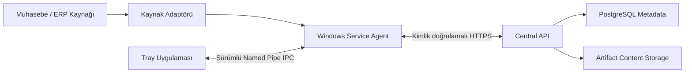
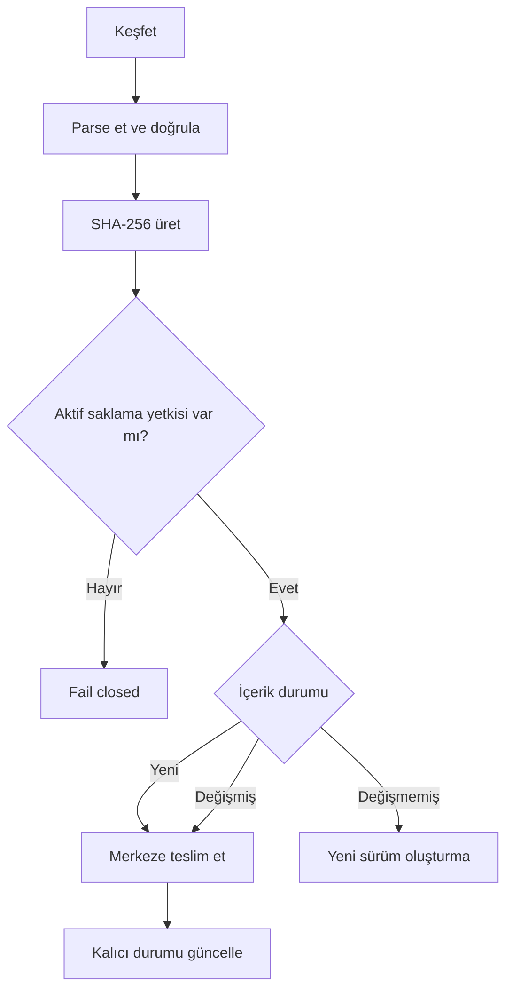
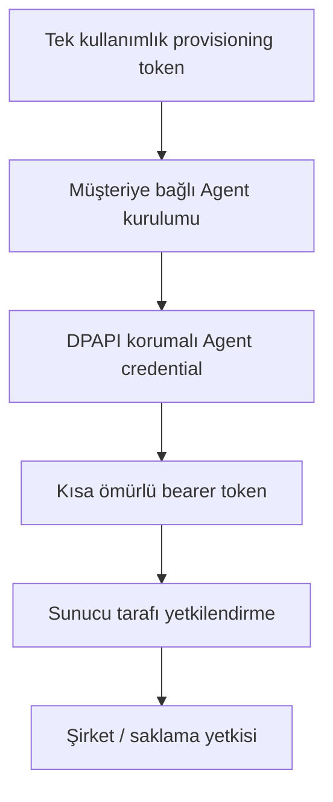

# Retivexa — Teknik Vaka Çalışması

> Muhasebe ve ERP çıktılarının müşteri ortamından güvenli, izlenebilir ve dayanıklı biçimde merkezi platforma aktarılması için geliştirdiğim üretim odaklı Windows Agent mimarisi.

[Mimari](docs/architecture.md) · [Güvenlik ve Dayanıklılık](docs/security-and-reliability.md) · [Doğrulama ve Testler](docs/verification.md)

## Kısa Bakış

Retivexa; muhasebe/ERP sistemlerinin ürettiği dosyaları keşfeden, doğrulayan, içerik parmak izi oluşturan, yetki kontrolünden geçiren ve merkezi sisteme teslim eden bir platformdur.

Çözümün ilk kaynak sağlayıcısı ORKA olsa da çekirdek tasarım belirli bir ürüne bağlı değildir. Kaynak sisteme özgü davranışlar adaptör arkasında tutulur; böylece yeni ERP ve muhasebe sistemleri çekirdek iş akışını değiştirmeden eklenebilir.

Bu depo, private olarak geliştirilen ürünün kaynak kodunu paylaşmadan mimari kararlarını, güvenlik sınırlarını ve doğrulama yaklaşımını sunar.

## Çözdüğüm Problem

Müşteri makinelerindeki finansal dokümanların merkezi bir sisteme taşınması yalnızca “dosya yükleme” problemi değildir. Üretim ortamında şu soruların birlikte çözülmesi gerekir:

- Dosya değişiklikleri kaçırılmadan nasıl bulunur?
- Aynı içerik tekrar tekrar sürümlenmeden değişiklik nasıl anlaşılır?
- Bir makinenin hangi müşteri ve şirketler adına işlem yapabileceğine kim karar verir?
- Ağ veya servis kesintisinde yarım kalan teslimatlar nasıl devam eder?
- Kimlik ve operasyonel durum; servis yeniden başlatma, Windows yeniden başlatma, yükseltme ve yeniden kurulum boyunca nasıl korunur?
- Destek için yeterli tanı verisi üretilirken kimlik bilgileri ve finansal içerik nasıl dışarıda tutulur?

Retivexa bu gereksinimleri tek bir Agent yaşam döngüsü içinde ele alır.

## Mimari Özet

Windows Service yerel iş akışının ve hassas durumun sahibidir. Tray yalnızca sunum ve kontrol istemcisidir. Merkezi API ise müşteri bağı, yetkilendirme, saklama hakkı ve merkezi kayıtlar için otoritedir.

## Öne Çıkan Mühendislik Kararları

| Alan | Uygulanan yaklaşım | Sağladığı değer |
|---|---|---|
| Kaynak bağımsızlığı | Sağlayıcı adaptörleri | Yeni ERP/muhasebe kaynaklarının çekirdeği bozmadan eklenmesi |
| Dosya keşfi | File watcher + periyodik reconciliation | Düşük gecikme ile doğruluk ve kaçırılan olaylardan toparlanma |
| Sürümleme | SHA-256 içerik parmak izi | Değişen içeriğin yeni sürüm olması, değişmeyenin çoğaltılmaması |
| Yerel çalışma | LocalSystem Windows Service | Kullanıcı oturumu olmasa da sürekli çalışma |
| Masaüstü iletişimi | ACL korumalı, sürümlü Named Pipe IPC | Hassas durumun Tray sürecine taşınmaması |
| İlk aktivasyon | Tek kullanımlık ve süreli provisioning token | Kontrollü makine–müşteri eşleştirmesi |
| Kimlik bilgisi | DPAPI `LocalMachine` + sıkı ProgramData ACL'leri | Makineye bağlı ve sıradan kullanıcıdan yalıtılmış saklama |
| API erişimi | Kısa ömürlü JWT bearer token | Kalıcı kimlik bilgisinin her istekte taşınmaması |
| Yetkilendirme | Merkezi customer/company/storage entitlement kontrolü | Dosya görünürlüğü ile depolama yetkisinin ayrılması |
| Teslimat | Kalıcı durum ve retry akışı | Servis veya makine yeniden başladığında yarım işin sürdürülmesi |
| Gözlemlenebilirlik | Yapılandırılmış loglar ve correlation ID | Uçtan uca teslimat takibi ve hata analizi |
| Tanılama | Seçili ve sanitize edilmiş ZIP çıktısı | Destek verisi sağlarken secret, state ve artifact içeriğini dışarıda tutma |
| Dağıtım | WiX tabanlı per-machine x64 MSI | Kontrollü kurulum, yükseltme, kaldırma ve yeniden kurulum |

## Uçtan Uca Artifact Akışı

Watcher düşük gecikmeli keşif sağlar; reconciliation ise doğruluk mekanizmasıdır. Bu ayrım, filesystem olayları kaçırılsa veya Agent bir süre çalışmasa bile kaynağın yeniden taranarak doğru duruma ulaşmasını sağlar.

## Güvenlik Modeli

Güvenlik modeli tek bir kimliğe dayanmaz. Bootstrap yetkisi, kalıcı Agent kimliği, kısa ömürlü erişim token'ı ve iş düzeyindeki saklama yetkisi birbirinden ayrıdır.

Yerel dosyaya erişebilmek merkezi saklama izni anlamına gelmez. Agent, aktif yetki kapsamı dışındaki artifact'ler için **fail closed** davranır. Merkezi sistem geçici olarak erişilemezse son başarılı politika ve yetki snapshot'ı kontrollü çevrimdışı devamlılık için korunur; başarılı bir sonraki senkronizasyon her zaman yerel cache'in önüne geçer.

## Dayanıklılık ve Yaşam Döngüsü

- Artifact ve teslimat durumu `%ProgramData%` altında kalıcı tutulur.
- Yarım kalan teslimatlar başlangıçta bulunur ve aynı correlation bilgisi korunarak devam ettirilir.
- Agent; servis restart'ı, gerçek Windows reboot'u ve geçici merkezi sistem kesintisinden toparlanır.
- Normal major upgrade kimliği, credential'ı ve operasyonel durumu korur.
- Eski MSI sürümüne downgrade engellenir.
- Normal uninstall uygulama bileşenlerini kaldırır, operasyonel ProgramData durumunu korur.
- Reinstall mevcut kimlik ve DPAPI korumalı credential ile yeniden provisioning gerektirmeden devam edebilir.

## Doğrulama Özeti

`v0.4.0` kabul kapsamı; provisioning, authentication, entitlement değişimi, yeni/değişmiş/değişmemiş artifact davranışı, kesilen teslimatın toparlanması, servis restart'ı, gerçek Windows reboot'u, offline/online geçişi ve MSI yaşam döngüsünü içerir.

**Son kayıtlı regresyon sonucu: 568 başarılı, 0 başarısız test.**

Test sayısı tek başına kalite kanıtı değildir; bu nedenle kabul yaklaşımı otomatik testleri gerçek Windows ortamında MSI kurulumu, servis hesabı, reboot, upgrade, uninstall ve reinstall kontrolleriyle tamamlar. Ayrıntılar için [doğrulama notlarına](docs/verification.md) bakabilirsiniz.

## Teknoloji ve Araçlar

`C#` · `.NET 9` · `ASP.NET Core Web API` · `Entity Framework Core` · `PostgreSQL` · `Windows Service` · `WinForms` · `Named Pipes` · `JWT` · `DPAPI` · `WiX Toolset` · `xUnit`

## Benim Rolüm

Retivexa'yı uçtan uca tasarlayıp geliştiriyorum. Sorumluluk alanlarım:

- domain ve uygulama mimarisi,
- Windows Service ve Tray ayrımı,
- kaynak adaptörü ve keşif/reconciliation akışı,
- provisioning, authentication ve authorization sınırları,
- kalıcı state, retry ve restart recovery,
- Central API ve metadata persistence,
- MSI yaşam döngüsü,
- otomatik ve kurulu ortam kabul testleri,
- İngilizce/Türkçe teknik ve operasyonel dokümantasyon.

## Mevcut Kapsam ve Açık Sınırlar

Bu vaka çalışması `v0.4.0` için uygulanmış davranışı anlatır. Aşağıdakiler mevcut özellik olarak sunulmamaktadır:

- otomatik self-update ve rollback,
- mTLS veya TPM tabanlı kimlik,
- otomatik credential rotation,
- otomatik diagnostics upload,
- merkezi observability platformu,
- production dış arşiv sağlayıcısı entegrasyonu,
- hot/cold archive lifecycle,
- genel kullanıma açık rollout.

Bu ayrım, ürün yol haritasını mevcut teknik kanıttan ayırmak için bilinçli olarak görünür tutulmuştur.

## Depo Hakkında

Bu repository yalnızca teknik vaka çalışması ve mimari dokümantasyon içerir. Ürün kaynak kodu, müşteri verileri, gerçek endpoint'ler, secret'lar ve dağıtım paketleri private tutulmaktadır.

---

**Geliştirici:** [Ekrem Güngör](https://github.com/Ekrem-Gungor)  
**LinkedIn:** [linkedin.com/in/ekrem-güngör](https://www.linkedin.com/in/ekrem-güngör)
