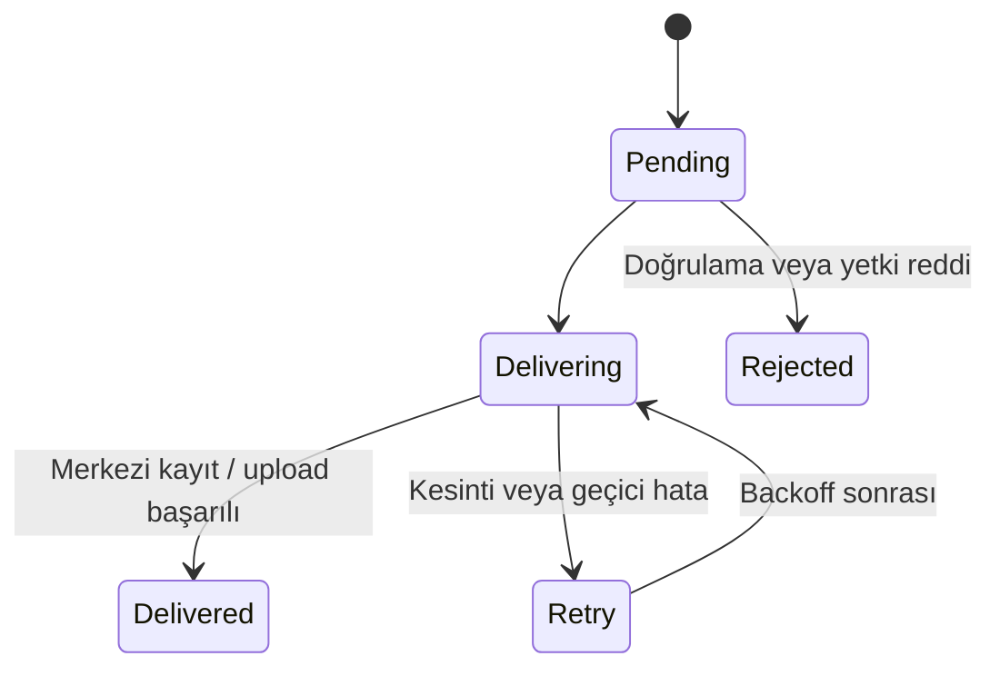

# Retivexa Mimari Notları

## Tasarım Hedefleri

Mimari beş temel hedef etrafında şekillendi:

1. Kaynak sağlayıcıdan bağımsız bir çekirdek oluşturmak.
2. Dosya sistemi olaylarına tek başına güvenmeden eksiksiz keşif sağlamak.
3. Hassas yerel durumu kullanıcı arayüzünden ayırmak.
4. Merkezi sistemi kimlik ve iş yetkisi için otorite tutmak.
5. Kesinti ve kurulum yaşam döngüsü boyunca aynı operasyonel kimliği korumak.

## Bileşen Sorumlulukları

| Bileşen | Ana sorumluluklar |
|---|---|
| Source Adapter | Sağlayıcıya özgü dizin, isimlendirme ve parse kurallarını çekirdekten ayırır. |
| Windows Service | Keşif, reconciliation, validation, fingerprint, state, delivery, auth, policy ve diagnostics iş akışlarını yürütür. |
| Tray | Kullanıcıya durum ve destek operasyonları sunar; hassas Agent state'ini doğrudan yönetmez. |
| Named Pipe IPC | Tray ile LocalSystem servisi arasında sürümlü ve ACL korumalı yerel iletişim sağlar. |
| Central API | Agent kimliğini doğrular; müşteri, şirket ve storage entitlement sınırlarını uygular; artifact kaydını yönetir. |
| PostgreSQL | Merkezi metadata ve operasyonel kayıtları tutar. |
| Content Storage Abstraction | Artifact içeriğini metadata'dan ayırır; mevcut filesystem implementasyonunun arkasında değiştirilebilir bir sınır sunar. |

## Kaynak Sağlayıcı Bağımsızlığı

ORKA ilk kaynak sağlayıcıdır; ancak domain modeli ORKA klasör yapısını veya format kurallarını çekirdeğe gömmez. Sağlayıcı adaptörü şu tür sorumlulukları üstlenir:

- izlenecek kökleri belirleme,
- aday dosyaları tanıma,
- path ve filename bilgisinden domain metadata çıkarma,
- sağlayıcıya özgü doğrulama kuralları.

Ortak Agent hattı ise keşfedilen artifact'i sağlayıcıdan bağımsız biçimde sürümler ve teslim eder.

## Watcher ve Reconciliation Ayrımı

File watcher hızlı geri bildirim sağlar ancak tek doğruluk kaynağı değildir. İşletim sistemi olayları yoğunluk, geçici erişim problemi veya Agent'ın çalışmadığı zaman aralığı nedeniyle kaçabilir.

Bu nedenle:

- watcher yeni değişikliği düşük gecikmeyle kuyruğa alır,
- ilk reconciliation başlangıçtaki gerçek durumu bulur,
- periyodik reconciliation kaçırılmış olayları ve drift'i düzeltir.

Kural: **Watcher hız içindir; reconciliation doğruluk ve toparlanma içindir.**

## Artifact ve Teslimat Durumu

Artifact, parse ve validation sonrasında SHA-256 fingerprint ile tanımlanır. Önce merkezi entitlement sınırı kontrol edilir, ardından kalıcı yerel durumla karşılaştırılır.

Kalıcı durum, uygulamanın yalnızca bellekteki kuyruğa bağlı kalmamasını sağlar. Restart sırasında `Delivering` olarak kalmış bir kayıt bulunursa güvenli biçimde yeniden ele alınır.

## Merkezi Metadata ve İçerik Ayrımı

PostgreSQL; artifact kimliği, sürüm, müşteri/şirket ilişkisi ve teslimat metadata'sı için kullanılır. Binary içerik erişimi ayrı bir abstraction arkasındadır.

Mevcut `v0.4.0` implementasyonu filesystem tabanlı content storage kullanır. Dış arşiv veya object storage entegrasyonu gelecekteki genişleme noktasıdır; mevcut üretim davranışı olarak değerlendirilmemelidir.

## Dağıtım Topolojisi

- x64, per-machine WiX MSI
- `RetivexaAgent` Windows Service
- başlangıç türü: Automatic
- servis hesabı: LocalSystem
- interaktif kullanıcı oturumunda Tray auto-start
- framework-dependent dağıtım; .NET 9 Desktop Runtime ön koşulu
- binary dosyalar Program Files altında
- kimlik, credential, cache, state, log ve diagnostics ProgramData altında

Bu ayrım, uygulama binary'leri değişirken makine kimliği ve operasyonel state'in korunmasını sağlar.
